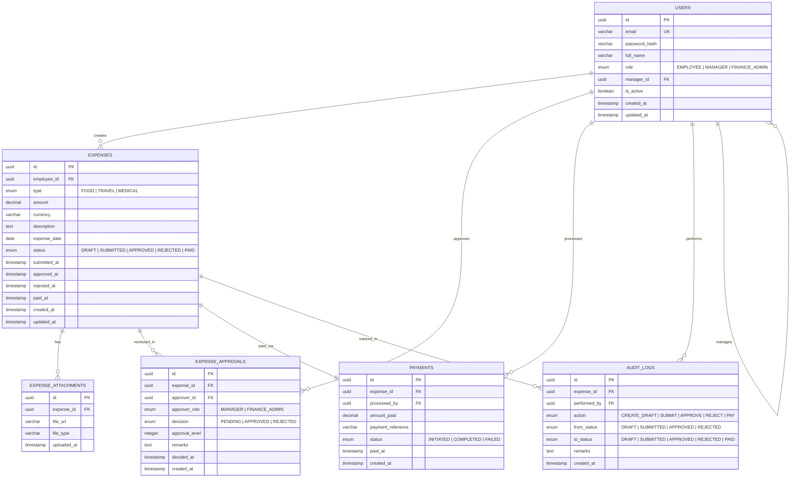

# ER Diagram — ChainFlow

## Overview
ClaimFlow is designed based on real-world corporate scenarios where companies reimburse employees for business travel, food expenses, and medical costs incurred during work-related activities.
---

# Schema Insights

The USERS table supports EMPLOYEE, MANAGER, and FINANCE_ADMIN roles with a self-referencing relationship (manager_id) to model team hierarchy.

The EXPENSE_APPROVALS table supports sequential approvals (Manager → Finance Admin) using approval_level for ordered processing.

The AUDIT_LOGS table records every action (Submit, Approve, Reject, Pay) with status transitions for full traceability.

The PAYMENTS table maintains a one-to-one relationship with EXPENSES, ensuring each approved claim is paid exactly once.
