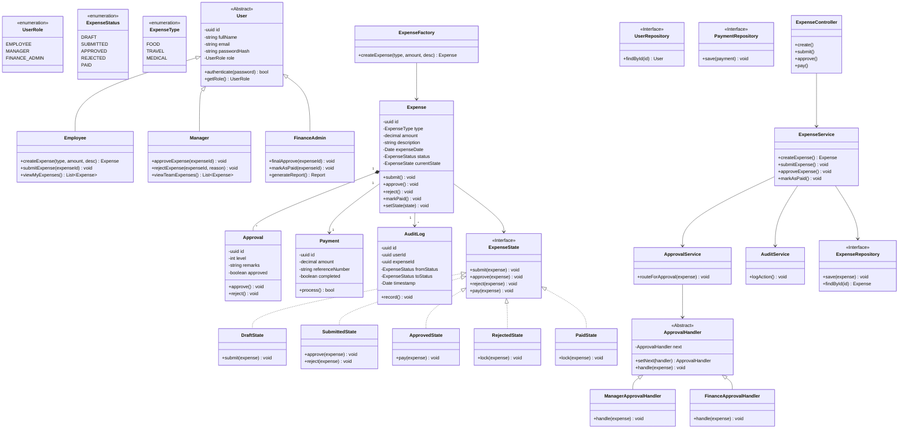

## Class Diagram - ChainFlow

# Overview

Here is a **short and simple version**:

---

## OOP Principles Applied

**Abstraction:**
`User` is abstract, and `ExpenseState` hides the internal logic of state transitions.

**Inheritance:**
`Employee`, `Manager`, and `FinanceAdmin` extend `User`.
Approval handlers extend `ApprovalHandler`.

**Encapsulation:**
All fields are private and accessed through public methods to protect business rules.

**Polymorphism:**
Different `ExpenseState` classes define different behaviors for methods like `approve()` and `reject()`.

**Composition:**
`Expense` strongly owns `Approval` and `AuditLog`, meaning they depend on the expense lifecycle.

---
