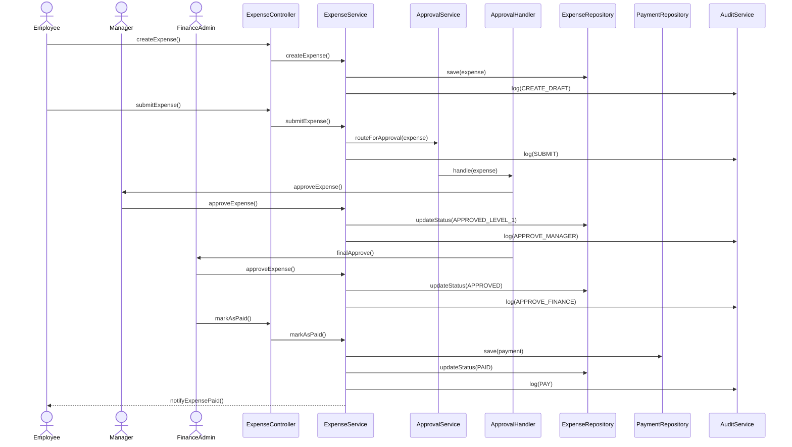

# Sequence Diagram: ChainFlow

## Overview
This diagram details the end-to-end execution flow of a "Payment Approval" use case, demonstrating the interaction between decentralized layers (Clean Architecture).

---

