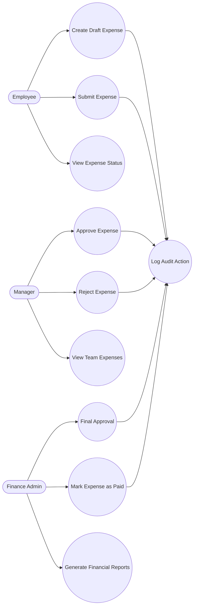

# Use case Diagram

## Authentication & Authorization:
All incoming requests are intercepted and validated to ensure the user is authenticated and has the correct role (Employee, Manager, Finance Admin) before performing any action.

## Workflow Enforcement:
The Service layer enforces business rules such as approval routing (Manager → Finance), valid state transitions (DRAFT → SUBMITTED → APPROVED → PAID), and prevents invalid operations.

## Audit & Transaction Integrity:
Every action (Submit, Approve, Reject, Pay) is logged in the AuditLog, and changes are committed to the database only after successful business validation to maintain consistency and traceability.
